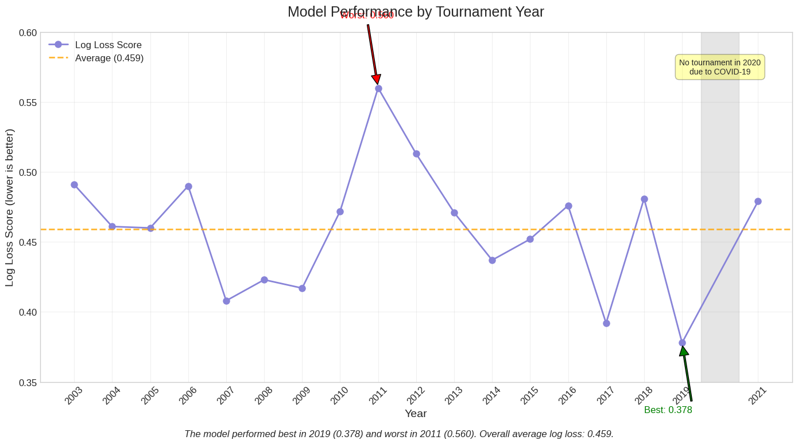

# March Madness Prediction Challenge

[](https://www.python.org/downloads/)
[](https://opensource.org/licenses/MIT)

A machine learning project to predict NCAA March Madness tournament outcomes using historical game data, team ratings, and betting odds.

## Overview

This project was developed as part of the Kaggle March Madness Machine Learning Competition. We built and evaluated several models to predict the probability of team victories in tournament matchups, with the goal of minimizing log loss.

Our most successful model combined historical game results with Pomeroy ratings and betting odds data, achieving an average log loss score of 0.459, which outperformed the previous year's winning submission (0.515).



## Key Features

- Multiple prediction models including Logistic Regression and XGBoost
- Feature engineering incorporating team performance metrics, expert ratings, and betting market data
- Web scraping components to collect Pomeroy ratings and historical betting odds
- Cross-validation approach that respects the temporal nature of sports prediction
- Comprehensive evaluation framework for model comparison

## Models & Results

We explored four main modeling approaches:

1. **Linear Regression** - Predicting score difference → probability
2. **Logistic Regression** - Direct win probability classification
3. **XGBoost Regression** - Advanced score difference prediction
4. **XGBoost Classification** - Advanced win probability classification

Our models were evaluated using log loss on tournament games from 2003-2021:

| Model | Using 538 Rankings | Using Betting Data & Pomeroy Ratings |
|-------|:------------------:|:------------------------------------:|
| Regression | 0.578 | 0.521 |
| Classification | 0.566 | **0.459** |
| XGBoost Regression | 0.570 | 0.488 |
| XGBoost Classification | 0.630 | 0.470 |

The **Logistic Classification model with betting data and Pomeroy ratings** achieved the best performance, significantly outperforming our baseline.

## Repository Structure

- `data/` - Contains processed datasets and data documentation
- `models/` - Jupyter notebooks for model development and evaluation
- `notebooks/` - Exploratory data analysis and visualization
- `scripts/` - Data collection and preprocessing scripts
- `images/` - Visualizations and charts
- `docs/` - Documentation and GitHub Pages content

## Getting Started

### Prerequisites

- Python 3.9+
- Required packages in `requirements.txt`

### Installation

```bash
# Clone the repository
git clone https://github.com/yourusername/march-madness-prediction.git
cd march-madness-prediction

# Create a virtual environment
python -m venv venv
source venv/bin/activate  # On Windows: venv\Scripts\activate

# Install dependencies
pip install -r requirements.txt
```

### Running the Models

The models are implemented as Jupyter notebooks in the `models/` directory. To run a model:

```bash
jupyter notebook models/betting_model.ipynb
```

## Contributors

- Samuel Kellum
- Ethan Perello

## Acknowledgments

- Prof. Mattei (Mentor)
- Prof. Zheng
- Kaggle for providing the competition framework and data
